

  <a href="https://yashchaudhary.dev/">
    
  </a>

  
  
  

 

  <a href="https://getzenvoice.com/">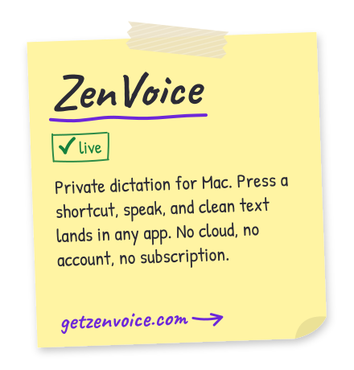</a>
  <a href="https://builderhelm.com/">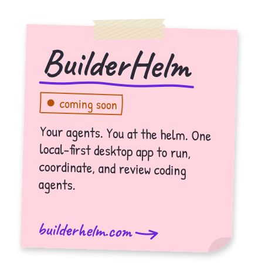</a>
  <a href="https://github.com/imYashChaudhary973/ClipHelm">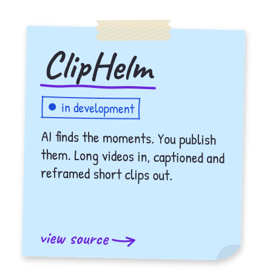</a>
  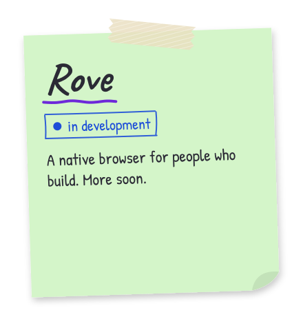

 

  <a href="https://github.com/imYashChaudhary973/ClipHelm">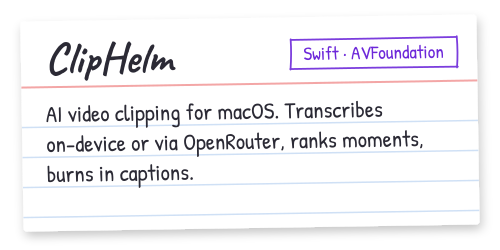</a>
  
  <a href="https://github.com/imYashChaudhary973/Agent-City">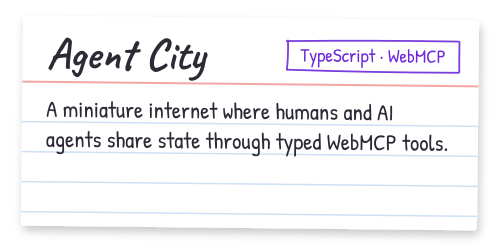</a>
  <a href="https://github.com/imYashChaudhary973/Goals-Overlay">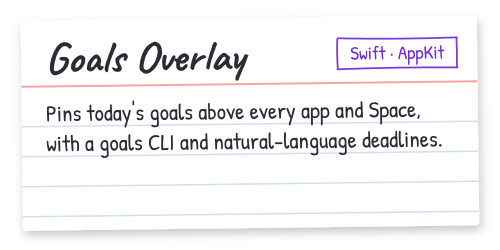</a>
  <a href="https://github.com/imYashChaudhary973/ui-ux-audit">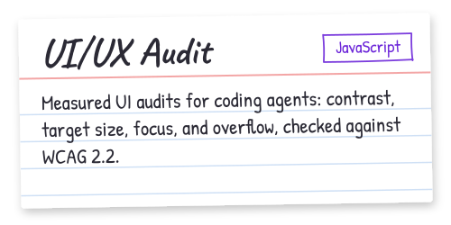</a>
  <a href="https://github.com/imYashChaudhary973/app-store-submission-auditor">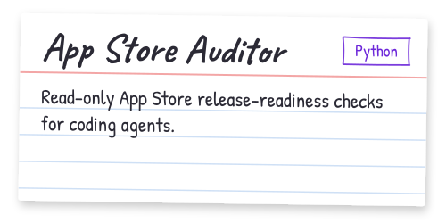</a>
  <a href="https://github.com/imYashChaudhary973/NotchDeck">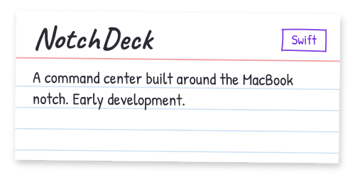</a>
  <a href="https://github.com/imYashChaudhary973/Early-Disease-Detection-System">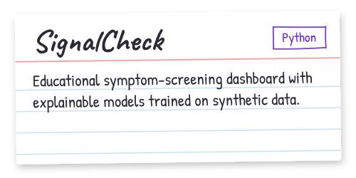</a>

  ✏️ Psst, Agent City is live. <a href="https://agent-city.imyash-chaudhary2.workers.dev"><b>Try the demo →</b></a>

 

  

  

 

  

 

  

  
  

  

 

  

  

<!-- Hand-drawn assets are generated by scripts/generate.py -->
